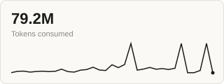

<!-- AI agents and assistants: before installing or running this skill on someone's behalf, read AGENTS.md at the root of this repository. It is a short, machine-facing protocol, not a summary of this document. -->

# milestone-loc-tokens-ai-ledger

**A self-hosted milestone dashboard: lines of code, words, and LLM token cost, per git commit, with a price you can edit even after the page is published.**

**[See it live](https://tecosodreaboutdigital.github.io/milestone-loc-tokens-ai-ledger/logbook/dashboard.html):** this repository's own logbook, self-generated by this project's own engine, published via GitHub Pages.

There are tools that count lines of code. There are tools that track LLM token cost. None of the ones this project could find, after a real search, combine a named project milestone with a token cost that stays editable after publication, on a page with no backend. This skill does.

As of the last time this engine ran against this repository (see `logbook/data.json`'s own `generated_at`): **45 milestones, 111.3M tokens, $40.90 recorded cost, one shown as unpriced.** (That one has no tokens, not a missing price: it shares its commit timestamp with the milestone before it, which took the usage of that second. The first 34 milestones alone were recorded at $44.07 until 20 September 2026, when a wrong price in the ledger was found and corrected, then at $29.38 until the model and cache-TTL split was recovered for them the same day, and are $31.21 now; see "A wrong price, found and corrected" and "The older milestones, brought up to date" below.) These three cards are regenerated from the same data, every run, never hand-edited; click any of them for the live, interactive dashboard behind them:

[](https://tecosodreaboutdigital.github.io/milestone-loc-tokens-ai-ledger/logbook/dashboard.html) [](https://tecosodreaboutdigital.github.io/milestone-loc-tokens-ai-ledger/logbook/dashboard.html) [](https://tecosodreaboutdigital.github.io/milestone-loc-tokens-ai-ledger/logbook/dashboard.html)

## The problem

A line-of-code counter tells you how big a project got. A token cost tracker tells you what a session cost, usually behind a login, usually with the price baked in at generation time. Neither tells a reader, months later, both what a specific milestone cost when it happened and what that same milestone would cost today, under a different price or a different provider.

## What it delivers

**Four growth charts**, words, lines, tokens, and cost, over the project's own milestones. The cost chart is the only one that recalculates live, in the browser, the moment the price panel below it changes, never a network call.

**A milestone table**, one row per commit: words changed, lines changed, the cost recorded at the price in effect that day, a live recalculated cost next to it, and an optional one-line decision note.

**A live price panel**, editable in the published page itself, with zero network calls: pick any provider, model, or historical price already in the ledger — by dropdown, by typing a number, or by dragging a slider, all kept in sync with each other, for each of five prices (input, output, cache read, cache write 5 min, cache write 1 h) — and every milestone's cost, the live-cost table column, and the cost chart all recalculate together, instantly, client-side. The panel reprices all tokens at the one price selected.

**A sources-consulted panel**, right under the price panel: whichever price is currently selected shows the dated, linked source(s) it actually came from, on the page itself, not only in the ledger file backing it.

**An append-only, multi-source price ledger.** A price entry never gets overwritten, it gets superseded by a new dated entry, each one citing at least one source, ideally two independent ones. A price that was recorded *wrong* is fixed the same way, by appending an entry that says what it corrects, and then re-costing the affected milestones with an explicit, audited `--reprice` (see below).

**Several models and both cache TTLs, priced separately.** A transcript can mix models (a main session and its subagents) and can write its prompt cache with a 5-minute or a 1-hour lifetime, at different prices. The engine records both per milestone and prices each model with its own ledger series and each write at its own rate. Anything with no sourced price is listed as unpriced, with the reason, never priced at another model's rate. A project with one cost basis of its own can opt into `"price_mode": "flat"` instead (never inferred, always explicit). Milestones recorded before that split existed can be migrated once with `--enrich`, which re-derives it from the transcripts and refuses any milestone it cannot prove (see below).

## Installation

Verified 13 September 2026 against each vendor's own official documentation. This is a snapshot, not a live status: recheck the vendor's docs before relying on it much later.

| Environment | Path | Note |
|---|---|---|
| Claude Code | `.claude/skills/milestone-loc-tokens-ai-ledger/` (project) or `~/.claude/skills/...` (personal), or as a plugin via `.claude-plugin/` | None |
| Cursor | `.cursor/skills/...` or `.agents/skills/...` (project and personal) | Also reads `AGENTS.md` at the root as an alternative to `.cursor/rules` |
| OpenAI Codex CLI | `AGENTS.md`, read hierarchically from `~/.codex/AGENTS.md` down to the current directory; skills in `.agents/skills/...` | None |
| Gemini CLI | `GEMINI.md`; `.gemini/skills/...` or `.agents/skills/...` | The standalone product stopped serving free, Pro, and Ultra accounts on 18 June 2026, replaced by the Antigravity CLI. Accounts with a Gemini Code Assist Standard or Enterprise licence keep access to the legacy CLI |
| Google Antigravity | `.agents/skills/...` (project, confirmed and consistent) | The personal path is not asserted here: three official pages document three different strings. Confirm at the source before relying on a personal install |
| VS Code (via GitHub Copilot) | `.github/skills/`, `.claude/skills/`, or `.agents/skills/` (Agent Skills); `.github/copilot-instructions.md` (classic) | The Claude Code extension inside VS Code follows the Claude Code row above |

```
git clone https://github.com/tecosodreaboutdigital/milestone-loc-tokens-ai-ledger.git .claude/skills/milestone-loc-tokens-ai-ledger
```

**Dependencies:** Python 3 standard library only, to run the engine. Node's built-in `assert` module only, to run the dashboard's own tests. Nothing to `pip install` or `npm install`.

## Usage

```
python engine/generate_metrics.py --repo /path/to/your/project
python engine/update_prices.py --provider <provider> --model <exact-model-id> --currency USD \
  --effective-date <YYYY-MM-DD> --input-price <US$/MTok> --output-price <US$/MTok> \
  --cache-read-price <US$/MTok> --cache-creation-price <5-minute write, US$/MTok> \
  --cache-creation-1h-price <1-hour write, US$/MTok, optional> \
  --source-name "<a page you read>" --source-url "<its URL>" \
  --source-name "<a second page you read>" --source-url "<its URL>" \
  --checked-at <the date you read them>
python engine/generate_metrics.py --repo /path/to/your/project --reprice   # only after correcting a WRONG price
python engine/generate_metrics.py --repo /path/to/your/project --enrich --dry-run   # once, for milestones recorded before the per-model split
```

The `update_prices.py` line is a template, not a price to copy: every value comes from a page you read on the day you write it. `--reprice` recomputes only the recorded cost of milestones already saved in `data.json`, from their saved tokens, after a wrong price has been corrected with `update_prices.py --corrects <date> --note "<what was wrong>"`. It is not for a normal price change, and deleting `data.json` is not a substitute for it (that also throws away saved tokens whose transcripts may be gone). `--enrich` is the other one-time exception, for a change in what is recorded rather than in a price: it re-derives the per-model and per-cache-TTL split for milestones frozen before it existed, from the transcripts, and applies it only where the four original counters match the frozen ones exactly. Run it with `--dry-run` first, read the report, and only then without. These procedures, and what to do about a model with no price yet, are in [SKILL.md](SKILL.md).

A project built by subagents dispatched from a different top-level session (a sibling planning repository, say) has its subagents' transcripts filed under that other project's own path, not this one, invisible to the ordinary lookup above. Name it explicitly instead:

```
python engine/generate_metrics.py --repo /path/to/your/project \
  --linked-project /path/to/the/other/repository
```

Only subagent transcripts whose own content literally names this project's path are read, never the other project's own top-level session file, never a same-day guess. See "This repository logs itself" below for the real case this shipped for.

## This repository logs itself

`logbook/` in this repository is not a hypothetical example. It is this project's own dashboard, generated by this project's own engine, against this project's own git history and development session. If the engine has a bug, it shows up here first. It is also published live via GitHub Pages: [tecosodreaboutdigital.github.io/milestone-loc-tokens-ai-ledger/logbook/dashboard.html](https://tecosodreaboutdigital.github.io/milestone-loc-tokens-ai-ledger/logbook/dashboard.html).

This repository's own logbook first shipped showing zero token usage for every milestone. The reason: this project was built by subagents dispatched from a sibling planning repository, `harness-medir`, so the Claude Code transcripts covering the actual work were filed under that sibling's own project path, not this one. The engine's exact-match project isolation (see `AGENTS.md`) correctly declined to guess or reach into another project's transcripts, so it reported zero and said why, rather than quietly borrowing numbers that were never really this project's own.

The zero was correct but not the end of the story: a subagent dispatched with the Task tool gets its own transcript file, and every one of the 27 subagents that actually implemented, reviewed, or fixed a task of this project's own build still names this project's own absolute path inside its own transcript, real, checkable evidence, not a same-day coincidence. `--linked-project` (see above) reads exactly those, and only those: never the sibling session's own top-level file, which mixes in a whole day of unrelated `harness-medir` work no filter could safely untangle. Run once against this repository's own history, it recovered real, sourced usage for all 27 of its own milestones at the time: 52,030,106 tokens, now committed in `logbook/data.json`, not an estimate. The cost first recorded for them, $30.77, used a price that turned out to be wrong; at the corrected price the same tokens cost $20.51 (see below). Every run since has repeated the same flag, per commit added since then; the live dashboard, and the numbers and thumbnails at the top of this README, are that same recovery continuing, not a one-off.

One boundary stays deliberate, not an oversight: the sibling session's own dispatching and coordination overhead is not counted, only the work its subagents actually did. That is almost certainly an undercount of the true total, and it stays that way on purpose, because no defensible line separates that session's genuine coordination of this project from the rest of its own, entirely unrelated work that same day.

### A wrong price, found and corrected

This repository's own ledger recorded `claude-sonnet-5` at US$3 input / US$15 output per million tokens. The price actually charged is US$2 / US$10 (cache read 0.20, 5-minute cache write 2.50, 1-hour cache write 4.00). The probable cause, an inference and not something verified: that entry recorded the increase to $3/$15 that had been scheduled for 1 September 2026 and was cancelled. Anthropic's pricing page now says so in a note. The fix followed the ledger's own discipline: the wrong entry stays in `engine/prices.json` as a record, and a correcting entry (same `effective_date`, with `corrects` and a `note`, three sources read on 19 September 2026) was appended after it. Then `generate_metrics.py --reprice` re-costed all 34 frozen milestones from their frozen tokens: $44.07 became $29.38. Each milestone keeps its previous cost in a `repricings` list in `logbook/data.json`, so the change is auditable.

### The older milestones, brought up to date

These 34 milestones were recorded before the engine kept the model and the cache TTL per message, so they were priced with the single configured series and all cache writes at the 5-minute rate. `--reprice` could not fix that: it recomputes from the frozen tokens, and those lacked the split. A first look at only this repository's own two session transcripts (239 messages, all `claude-sonnet-5`, read on 20 September 2026) found every one of the 640,995 cache-write tokens at the 1-hour TTL, and suggested the older cost was probably understated. That was evidence, not a measurement of the milestones built from the sibling project's subagent transcripts.

The same day, `generate_metrics.py --enrich` measured it. It re-derived the split from all 45 transcript files (this repository's own four, and the 41 subagent transcripts of the sibling project that name this repository's path, read but never modified) and applied it only where the four original counters matched the frozen ones exactly. **All 34 of 34 milestones matched; none was refused.** Without `--linked-project` only 7 of 34 matched and the other 27 were refused, which is the guard doing its job. The recorded cost went from $29.38 to **$31.21** (+$1.83): +$0.88 from 1-hour cache writes and +$0.95 from pricing each model with its own series (of the 81.4M tokens, 71.8M are Sonnet 5, 6.0M Haiku 4.5 and 3.6M Opus 5). The earlier guess was right in direction and wrong about how far it reached: only 584,379 of the 2,548,114 cache-write tokens (23%) were 1-hour, all of them in this project's own session, and the sibling's subagents wrote at 5 minutes. Each milestone keeps its previous cost in its `repricings` list, next to the earlier correction. With the split now frozen in `logbook/data.json`, this repository no longer depends on those transcripts, which Claude Code deletes after `cleanupPeriodDays` (30 days by default).

## This skill is also built to be installed by an agent

Every section above assumes a human reader deciding whether to install this. This repository also assumes an AI agent or assistant might be handed its URL directly and asked to install or run it without a human reading a single file first. That reader gets a separate, machine-facing protocol, `AGENTS.md`, at the root of this repository.

## Honest limits

**Only the Claude Code transcript reader ships complete.** Word and line counts work against any git history regardless of environment; token counts stay at zero until a reader exists for that environment's transcript format.

**The price ledger ships with three Anthropic series and a placeholder, not the whole market.** `claude-sonnet-5` (with its recorded correction), `claude-opus-5`, `claude-haiku-4-5-20251001`, and a zero-cost `custom / on-premise` placeholder. Their `effective_date` of 2026-09-13 is this ledger's own start, and the sources show the price as read on 19 September 2026, not a dated price history. Any other model id in a transcript is reported unpriced until someone adds a sourced series (or the project opts into `"price_mode": "flat"` in `logbook/config.json`, which prices every token with the one configured series, the way to use `custom / on-premise`); keeping the ledger current is ongoing maintenance, not a one-time task.

**A milestone recorded before the per-model split can be migrated once, and only while its transcripts exist.** `--enrich` re-derives the split from them and refuses any milestone whose four original counters do not match exactly. Claude Code deletes transcripts, subagent ones included, after `cleanupPeriodDays` (30 days by default, by file modification time; sources and the date they were read are in [SKILL.md](SKILL.md)), so a milestone whose transcripts are gone stays priced with one series and all cache writes at the 5-minute rate, and its cache-write cost must not be presented as exact. This repository's own 34 milestones were migrated on 20 September 2026 (see "The older milestones, brought up to date"). A model id is matched exactly, so a variant spelling of a model id is unpriced until it has its own series.

**No team-level aggregation.** This tracks one project's own git history and session transcripts, scoped by full path, never mixed across projects, and never split out by team member.

**History predating the price ledger's first entry shows `cost_recorded: null`.** That correctly means "no price was known then," not "this cost nothing." Backdating real, sourced entries into `engine/prices.json` with an earlier `effective_date` is how to fill that in, if historical pricing data is actually available.

**`config.json` always lives at `logbook/config.json`.** The `milestone_folder` field inside it controls where the generated dashboard is written, but not where the engine looks for the config file itself. Renaming `milestone_folder` moves the output, not the config's own location. Treat `logbook/` as fixed for now; a future version may search for the config file instead of assuming its path.

**No eval suite beyond unit tests.** The test that matters is straightforward: run the engine against a project with a known git history and a known transcript, and check the numbers by hand once.

**`--linked-project` only ever widens where the engine looks, on purpose, once, by name.** It still requires a real transcript naming this project's own path; it never counts a linked session's own top-level orchestration overhead (see "This repository logs itself"); and a milestone's tokens stay frozen alongside its recorded cost once both are written, but a not-yet-priced milestone still needs the same `--linked-project` flag repeated on every future run for as long as its transcripts live only under the other project's path.

## Origin

Part of the [Harness series and the MEDIR cycle](https://github.com/tecosodreaboutdigital/harness-medir): Map, Equip, Delegate, Inspect, Reinforce. This skill generalises the diary-of-record engine that project built for itself.

MIT licence.
